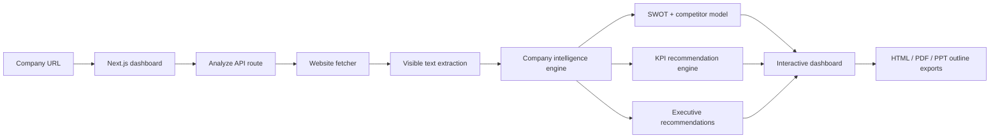

# AI Company Intelligence Platform Architecture

## Product Goal

The AI Company Intelligence Platform turns a company URL into an executive-level intelligence report. It is designed as a portfolio project for analytics engineering, BI, product analytics, AI business analysis, and data-focused startup roles.

## Architecture

## Implementation Notes

- Frontend: Next.js route at `/company-intelligence`
- Backend: API route at `/api/company-intelligence/analyze`
- Core logic: `lib/company-intelligence.ts`
- Sample data: `data/company-intelligence-sample-report.json`
- Exports: browser print for PDF, downloadable HTML report, and presentation outline

## Why This Project Is Recruiter-Friendly

- Demonstrates business problem framing, not only charts.
- Shows typed data modelling and modular report generation.
- Converts unstructured web content into structured executive insights.
- Includes KPI logic across business, product, marketing, and operations.
- Gives a clear interview story: "I built a platform that reduces manual company research from hours to minutes."

## Production Extensions

- Add OpenAI JSON-mode report refinement with source citations.
- Persist reports to PostgreSQL or Supabase.
- Add authenticated workspaces and saved company lists.
- Add Playwright-based screenshots for digital presence scoring.
- Add a proper PowerPoint export service.
- Add dbt models for historical company benchmark analytics.
